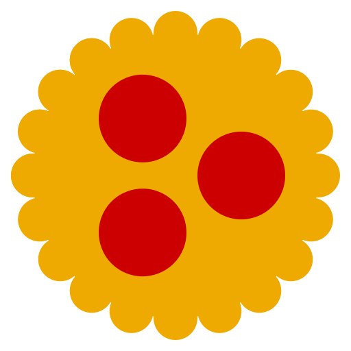

# @343dev/guetzli



[](https://www.npmjs.com/package/@343dev/guetzli)

[google/guetzli](https://github.com/google/guetzli) binary wrapper for Node.js

Supported:
- OS platform: `darwin`, `linux`, `win32`.
- CPU architecture: `arm64`, `x64`.

## Introduction

Guetzli is a JPEG encoder that aims for excellent compression density at high visual quality. Guetzli-generated images are typically 20-30% smaller than images of equivalent quality generated by libjpeg. Guetzli generates only sequential (nonprogressive) JPEGs due to faster decompression speeds they offer.

## Usage

Install:

```sh
npm i -g @343dev/guetzli
```

Compress:

```sh
guetzli [flags] input_filename output_filename
# or
cat image.jpg | guetzli - - > result.jpg
```

## Command line flags

- `--verbose` — Print a verbose trace of all attempts to standard output.
- `--quality Q` — Visual quality to aim for, expressed as a JPEG quality value (in units equivalent to libjpeg quality).
- `--memlimit M` — Memory limit in MB. Guetzli will fail if unable to stay under the limit. Default is 6000 MB.
- `--nomemlimit` — Do not limit memory usage.

## Notes

Guetzli uses a large amount of memory. You should provide 300MB of memory per 1MPix of the input image.

Guetzli uses a significant amount of CPU time. You should count on using about 1 minute of CPU per 1 MPix of input image.

Guetzli assumes that input is in **sRGB profile** with a **gamma of 2.2**. Guetzli will ignore any color-profile metadata in the image.

Guetzli is designed to work on high quality images. You should always prefer providing uncompressed input images (e.g. that haven't been already compressed with any JPEG encoders, including Guetzli). While it will work on other images too, results will be poorer. You can try compressing an enclosed sample high quality image.

JPEG images do not support alpha channel (transparency). If the input is a PNG with an alpha channel, it will be overlaid on black background before encoding.
